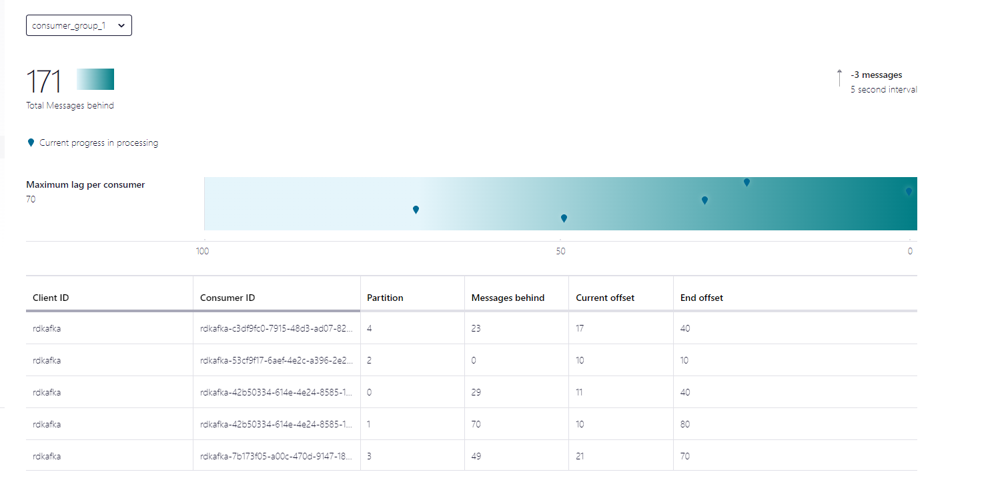
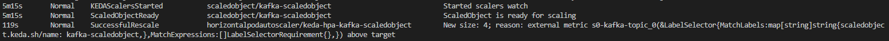
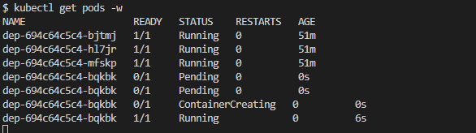
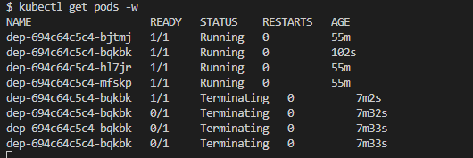
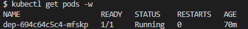

# confluent-keda-poc
### Description
This repo is to:
- Demo Keda connection to confluent
- Demo scaling capabilities of Keda

## Set up
### Kubernetes
Used Minikube
To get endpoint for minikube 
```
minikube service dep --url
```

### Go
```
touch main.go
// Add in basic server codes
go mod init confluent-keda-poc
go mod tidy
```

### Keda
Reference: 
- https://keda.sh/docs/2.7/deploy/
- https://keda.sh/docs/2.8/scalers/apache-kafka/#example
```
helm repo add kedacore https://kedacore.github.io/charts
helm repo update
kubectl create namespace keda
helm install keda kedacore/keda --namespace keda
```

## Observations
1. Spammed produce endpoint 
```
http://127.0.0.1:56825/api/produce
```

2. Confluent Cloud Consumer Lag
- Keda Consumer Lag Setting: `lagThreshold: "50"`


3. Scaling up



4. Scaling down


5. Scaling down to below original replicas of 3
- Keda Consumer Config: `minReplicaCount:  1`



## Issues to think about
- Message stuck due to error
- Partition Key specified for topic. Large consumer lag observed on one/few particular partitions.


## Others
To Observe and kill process on local
```
netstat -anop | grep -i 5000
pkill <PID>
kill -9 <PID>
```


